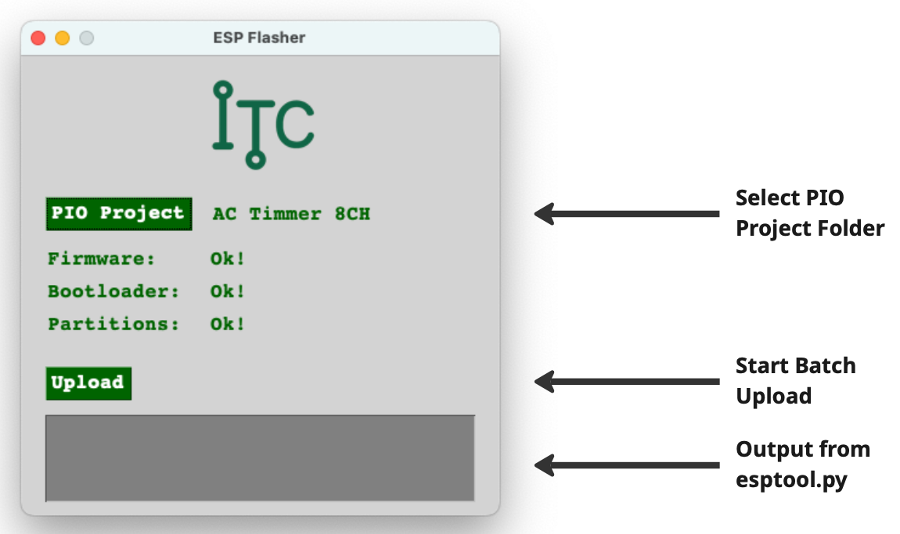

# ESP Flasher

This software can be used to upload firmware compiled in a PlatformIO project to multiple ESP devices. It will automatically detect a new ESP device connected to the computer and upload the code as long as the program is running.

